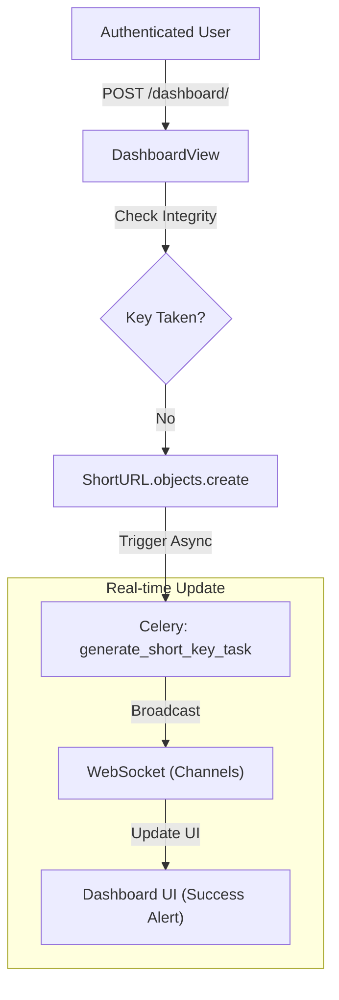
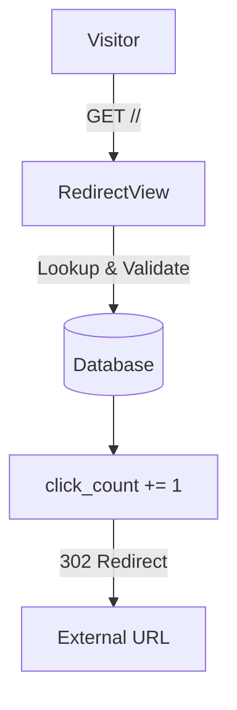

# Django URL Shortener

A robust URL shortening service built with Django, featuring asynchronous processing, custom aliases, and automated QR code generation.

## Features

- **URL Shortening:** Generate short, unique keys for long URLs using Base62 encoding.
- **Custom Aliases:** Users can specify a custom short code (slug) for their links.
- **QR Code Generation:** Automated QR code generation for every link via background tasks.
- **Real-time Notifications:** Instant dashboard updates when new URLs are processed via WebSockets (Django Channels).
- **Click Tracking:** Efficient tracking and display of click counts for each link (updates on page refresh).
- **Async Processing:** Background task execution using Celery and Redis for key and QR generation.
- **Dockerized Environment:** Fully containerized setup with Redis and Celery workers.
- **User Authentication:** Secure registration and login system.
- **API Documentation:** Integrated OpenAPI 3.0 (Swagger/Redoc) support.

## Tech Stack

- **Django 6.0**: Core web framework.
- **Django Channels**: Real-time WebSocket communication.
- **Celery & Redis**: Asynchronous task queue and message broker.
- **Daphne**: ASGI server for production-grade WebSocket support.
- **REST Framework**: For the SnapURL API layer.
- **Vanilla CSS**: Premium "glassmorphism" design.

## Quick Start (Docker) - Recommended

The easiest way to run the application is using Docker Compose.

1.  **Prepare Environment Variables:**
    ```bash
    cp .env.example .env
    ```

2.  **Launch the Application:**
    ```bash
    docker compose up --build
    ```
    The web app will be available at `http://localhost:8000`.

## API Documentation

SnapURL comes with a fully documented REST API powered by OpenAPI 3.0.

- **Swagger UI:** `http://localhost:8000/api/schema/swagger-ui/`
- **Redoc:** `http://localhost:8000/api/schema/redoc/`

## Project Workflows

### 1. URL Creation (Dashboard)


### 2. URL Redirection


## Contributing

Feel free to open an issue or send a PR.

Happy Coding! 🚀
