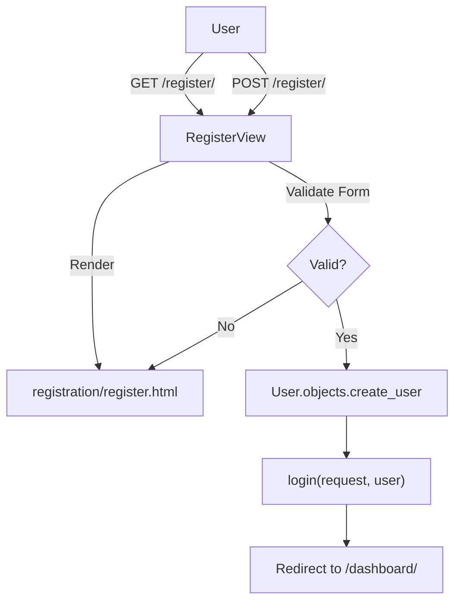
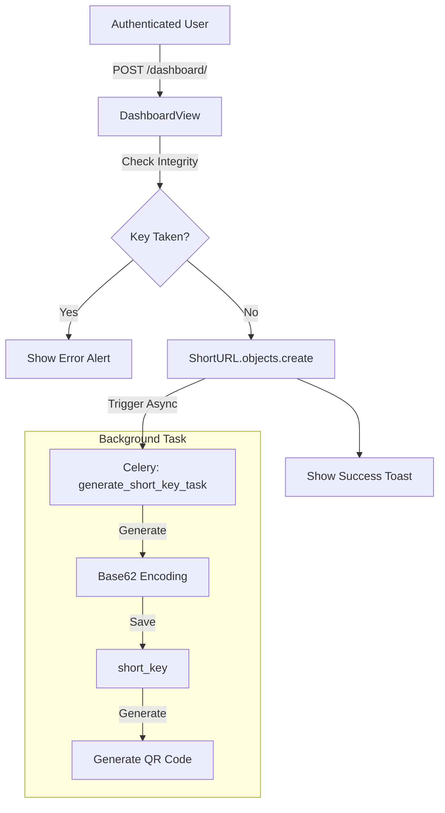
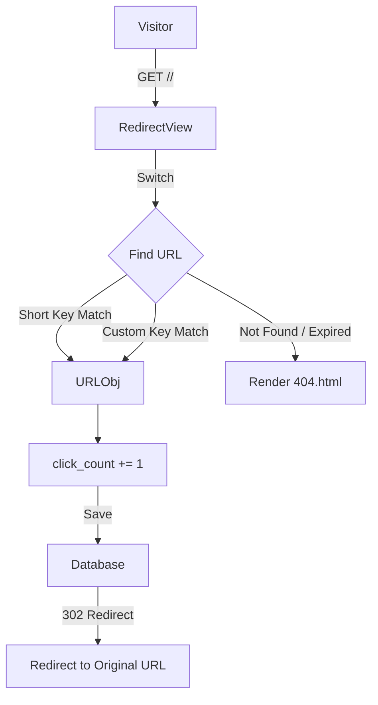

# Django URL Shortener

A robust URL shortening service built with Django, featuring asynchronous processing, custom aliases, and automated QR code generation.

## Features

- **URL Shortening:** Generate short, unique keys for long URLs using Base62 encoding.
- **Custom Aliases:** Users can specify a custom short code (slug) for their links.
- **QR Code Generation:** Automated QR code generation for every link via background tasks.
- **Click Tracking:** Real-time tracking and display of click counts for each link.
- **Async Processing:** Background task execution using Celery and Redis for key and QR generation.
- **User Authentication:** Secure registration and login system to manage personal links.
- **API Documentation:** Integrated OpenAPI 3.0 (Swagger/Redoc) support.

## Quick Start (Docker) - Recommended

The easiest way to run the application is using Docker Compose.

1.  **Prepare Environment Variables:**
    ```bash
    cp .env.example .env
    ```
    (Optional: Edit `.env` to change settings like `SECRET_KEY` or `DEBUG`)

2.  **Grant Execution Permissions:**
    ```bash
    chmod +x entrypoint.sh
    ```

3.  **Launch the Application:**
    ```bash
    docker compose up --build
    ```
    The web app will be available at `http://localhost:8000`. Hot-reloading is enabled by default in this mode.

---

## Alternative: Manual Setup (Local)

If you prefer to run it without Docker, follow these steps.

### Prerequisites
You'll need Python 3.12+ and **Redis** installed and running on your system.

### Step-by-Step Setup

1.  **Clone the Repo:**
    ```bash
    git clone git@github.com:prachanda980/django-url-shortener.git
    cd vrittech
    ```

2.  **Prepare Environment:**
    ```bash
    cp .env.example .env
    python3 -m venv venv
    source venv/bin/activate
    pip install -r requirements.txt
    ```

3.  **Database & Static Files:**
    ```bash
    python manage.py migrate
    python manage.py collectstatic --noinput
    ```

4.  **Running the Components:**

    You need to run the web server and the background worker simultaneously.

    **Web Server:**
    ```bash
    python manage.py runserver
    ```

    **Celery Worker:**
    ```bash
    celery -A url_shortener worker --loglevel=info
    ```

## How to Use It

1.  **Register:** Create an account at `/register/`.
2.  **Access Dashboard:** Log in to view your `/dashboard/`.
3.  **Shorten URL:** Input a long URL and an optional custom alias.
4.  **Track Clicks:** Monitor click statistics directly on the dashboard.

## API Documentation

SnapURL comes with a fully documented REST API powered by OpenAPI 3.0.

- **Swagger UI:** `http://localhost:8000/api/schema/swagger-ui/` (Interactive docs)
- **Redoc:** `http://localhost:8000/api/schema/redoc/` (Clean reference)
- **Schema:** `http://localhost:8000/api/schema/` (Raw JSON/YAML)

### Authentication
The API uses JWT (JSON Web Tokens). 
1. Get your tokens via `/api/auth/login/`.
2. For protected endpoints, include the header: `Authorization: Bearer <your_access_token>`.

## Project Workflows

Here is a look under the hood at how the data flows through the system.

### 1. User Registration


### 2. URL Creation (Dashboard)


### 3. URL Redirection


## Tech Stack

Just so you know what you're looking at:
 - **Django 6.0**: The web framework.
 - **Django REST Framework**: For the API endpoints.
 - **Celery & Redis**: For asynchronous background tasks.
 - **Bootstrap 5**: For the layout and styling.
 - **HTML5 & CSS3**: For that sweet glassmorphism look.

## Contributing

Feel free to poke around, break things, and fix them. If you find a bug (I'm sure there are a few!), open an issue or send a PR.

Happy Coding! 🚀
