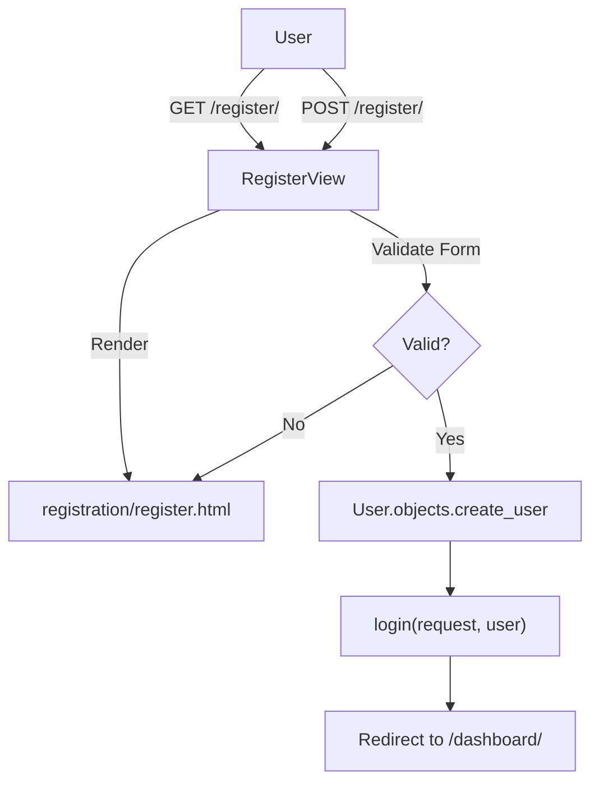
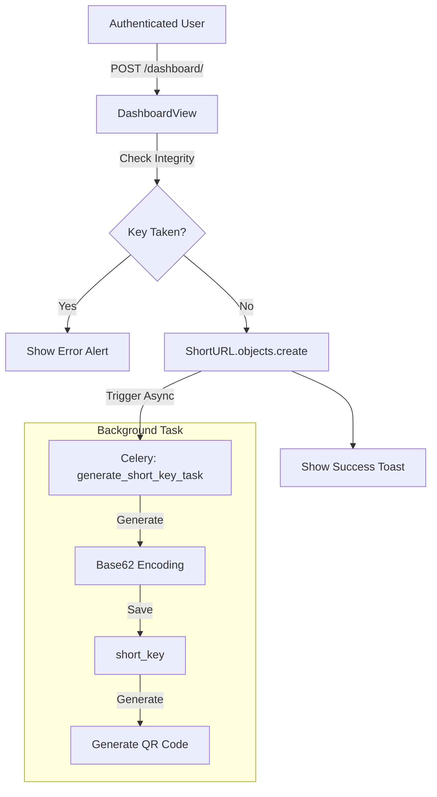
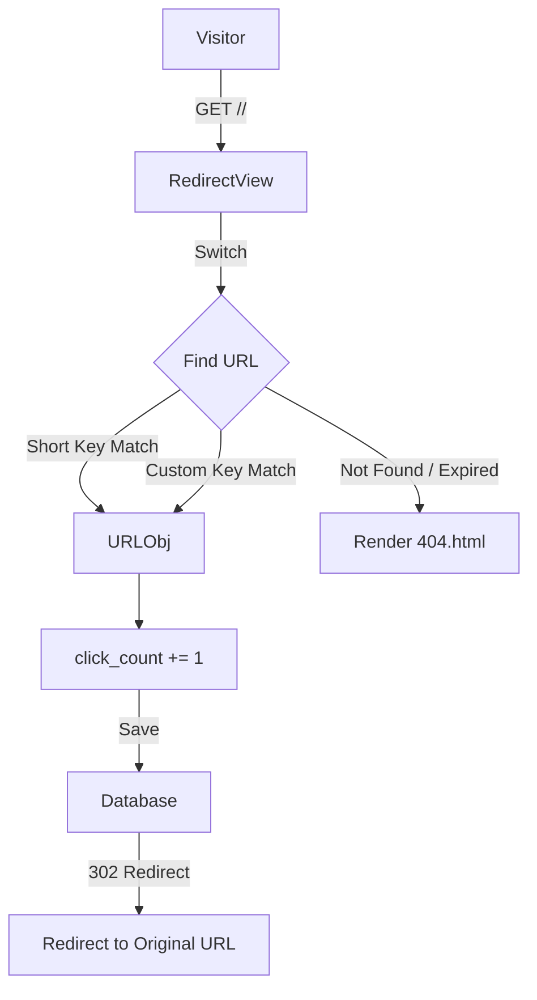

# SnapURL - The Friendly URL Shortener

Hey there! 👋 Welcome to SnapURL. This is a personal project I built to solve a simple problem: turning long, ugly URLs into short, shareable ones, without all the corporate clutter.

I wanted something that was fast, easy to use, and looked good while doing it. So, I built this using Django, threw in some Celery for async processing (gotta keep it snappy!), and wrapped it all in a nice glassmorphism UI.

## What's Inside?

Here's the cool stuff this project can do:
 - **Shorten Anything:** Turn mile-long links into short `snap.url/xyz` links.
 - **Custom Aliases:** Want `snap.url/my-awesome-link`? You got it.
 - **QR Codes:** Automatically generates a QR code for every link.
 - **Track Your clicks:** A dashboard that tells you how many people clicked your links.
 - **Async Power:** We use Celery and Redis to handle the heavy lifting in the background, so the site never lags.
 - **Secure:** Full user registration and login needed to manage your links.

## Getting Started

Want to run this locally? Awesome. Here is exactly how to do it.

### Prerequisites
You'll need Python installed (I recommend 3.12+), and you also need **Redis** running on your backend (we use it for the task queue).

### Step-by-Step Setup

1.  **Clone the repo:**
    ```bash
    git clone git@github.com:prachanda980/django-url-shortener.git
    cd vrittech
    ```

2.  **Set up your environment:**
    It is always best to work in a virtual environment.
    ```bash
    python3 -m venv venv
    source venv/bin/activate
    ```

3.  **Install the goods:**
    Grab all the dependencies.
    ```bash
    pip install -r requirements.txt
    ```

4.  **Database setup:**
    Run the migrations to set up your SQLite database (or whatever you configure).
    ```bash
    python manage.py migrate
    ```

5.  **Create a User:**
    You'll need an admin account to peek at the admin panel.
    ```bash
    python manage.py createsuperuser
    ```

## Running the App

This app has two parts that need to run at the same time: the web server and the background worker.

**Terminal 1: The Web Server**
```bash
python manage.py runserver
```
Go to `http://localhost:8000` in your browser. You should see the landing page!

**Terminal 2: The Background Worker**
This little guy handles the QR code generation and key assignment.
```bash
celery -A url_shortener worker --loglevel=info
```

## How to Use It

1.  **Sign Up:** Go to `/register/` and create an account.
2.  **Dashboard:** Once logged in, you'll land on the dashboard.
3.  **Create a Link:** Paste a long URL, optionally pick a custom name, and hit "Shorten".
4.  **Share:** Copy your new short link or download the QR code.

## Project Workflows

Here is a look under the hood at how the data flows through the system.

### 1. User Registration


### 2. URL Creation (Dashboard)


### 3. URL Redirection


## Tech Stack

Just so you know what you're looking at:
 - **Django 6.0**: The web framework.
 - **Django REST Framework**: For the API endpoints.
 - **Celery & Redis**: For asynchronous background tasks.
 - **Bootstrap 5**: For the layout and styling.
 - **HTML5 & CSS3**: For that sweet glassmorphism look.

## Contributing

Feel free to poke around, break things, and fix them. If you find a bug (I'm sure there are a few!), open an issue or send a PR.

Happy Coding! 🚀
